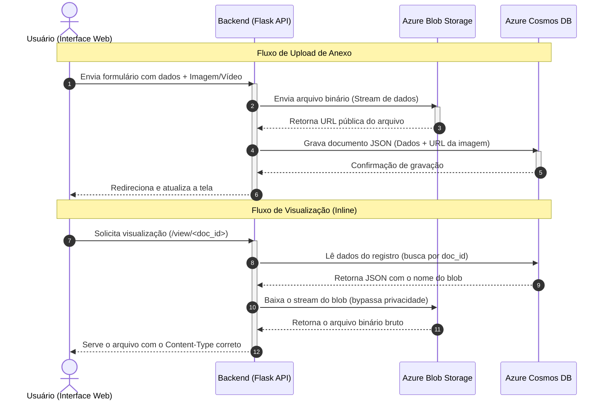

# Cosmos DB NoSQL & Azure Blob Storage Explorer

Este projeto é um laboratório prático que demonstra a implementação de uma **arquitetura híbrida na nuvem Microsoft Azure**, utilizando o banco de dados não-relacional **Azure Cosmos DB (NoSQL API)** para gerenciar metadados e o **Azure Blob Storage** para armazenar arquivos binários (imagens e vídeos).

O frontend apresenta um dashboard com visualização de dados via Chart.js, gerenciador de tags dinâmicas (*schemaless*) e uma interface moderna em estilo *Glassmorphism*.

---

## 📐 Arquitetura do Fluxo de Dados

A imagem abaixo ilustra como as duas ferramentas da Azure trabalham de forma independente e integrada sob a orquestração do backend Flask:



### Como funciona cada etapa:
1. **Upload resiliente:** O arquivo enviado é transmitido diretamente para a nuvem da Azure no Blob Storage. Para garantir a segurança nas políticas corporativas/estudantis da Azure, o contêiner de armazenamento é **100% privado**.
2. **Registro NoSQL:** Em vez de salvar o binário pesado no banco de dados, o Cosmos DB NoSQL registra apenas a estrutura de dados (JSON) contendo a URL pública gerada pelo Storage e o identificador do blob.
3. **Entrega de mídia segura:** Quando o usuário clica em visualizar ou baixar, a requisição passa pelo backend Flask que faz o download seguro da nuvem através da chave privada e entrega o arquivo diretamente na tela com o tipo de mídia correto (`image/png`, `image/jpeg`, etc.), fazendo com que o navegador renderize a foto inline em vez de forçar o download.

---

## 🌟 Funcionalidades
*   **Armazenamento Híbrido:** Separação de dados estruturados (Cosmos DB) e binários (Blob Storage).
*   **Tags Dinâmicas (Schemaless):** Permite adicionar pares de chave/valor dinamicamente aos documentos JSON.
*   **Fallback Local Automático:** Se as chaves de conexão da nuvem Azure não estiverem no `.env`, o sistema continua funcionando perfeitamente em modo offline, salvando as informações em um arquivo local JSON (`local_database.json`) e simulando os uploads.
*   **Dashboard Visual:** Gráficos interativos integrados com Chart.js que analisam os formatos de arquivo e os grupos de idade em tempo real.

---

## 🛠️ Tecnologias Utilizadas
*   **Backend:** Python 3 + Flask + Flask-CORS
*   **Drivers Azure:** `azure-cosmos` e `azure-storage-blob`
*   **Frontend:** HTML5, CSS3 (Glassmorphism), Bootstrap 5, FontAwesome 6, Chart.js
*   **Variáveis de Ambiente:** `python-dotenv`

---

## 🚀 Como Executar o Projeto

### Pró-requisitos
*   Python 3.10 ou superior instalado.
*   Conta de armazenamento (Storage Account) e recurso Cosmos DB provisionados na Azure.

### 1. Clonar o repositório
```bash
git clone https://github.com/geraldocafe1/Interface_Grafica_com_dados_nao_relacional.git
cd Interface_Grafica_com_dados_nao_relacional
```

### 2. Configurar o Ambiente Virtual
```bash
python -m venv .venv
# No Windows:
.venv\Scripts\activate
# No Linux/Mac:
source .venv/bin/activate
```

### 3. Instalar Dependências
```bash
pip install -r requirements.txt
```

### 4. Configurar as Variáveis de Ambiente
Crie um arquivo `.env` na raiz do projeto contendo as chaves da Azure (não comitar este arquivo):
```env
# Conexão do Cosmos DB NoSQL API (Endpoint + Key ou Connection String)
COSMOS_CONNECTION_STRING="AccountEndpoint=https://sua-conta.documents.azure.com:443/;AccountKey=sua-chave-secreta==;"
COSMOS_ENDPOINT="https://sua-conta.documents.azure.com:443/"

# Conexão do Azure Blob Storage
AZURE_STORAGE_CONNECTION_STRING="DefaultEndpointsProtocol=https;AccountName=seu-storage;AccountKey=sua-chave-secreta==;EndpointSuffix=core.windows.net"
AZURE_CONTAINER_NAME="uploads"
```

### 5. Iniciar o Servidor
```bash
python backend_mongodb_upload.py
```
O console exibirá as mensagens de sucesso ao conectar e o servidor estará disponível em:
👉 **[http://127.0.0.1:5000](http://127.0.0.1:5000)**
