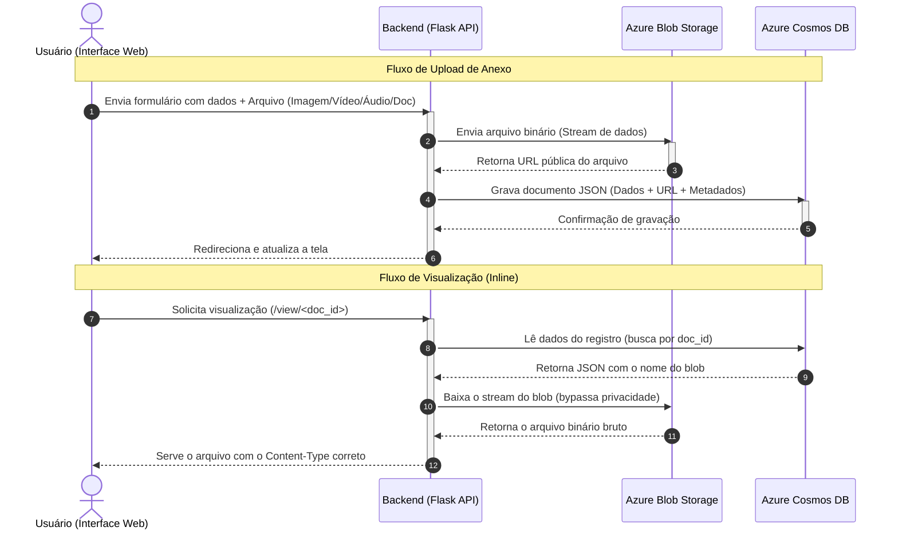

# Cosmos DB NoSQL & Azure Blob Storage Explorer

Este projeto é um laboratório prático que demonstra a implementação de uma **arquitetura híbrida na nuvem Microsoft Azure**, utilizando o banco de dados não-relacional **Azure Cosmos DB (NoSQL API)** para gerenciar metadados e o **Azure Blob Storage** para armazenar arquivos binários (imagens, vídeos, áudio e documentos).

O frontend apresenta um dashboard com visualização de dados via Chart.js, **galeria de mídias interativa**, gerenciador de tags dinâmicas (*schemaless*), filtros por categoria, preview de arquivos e uma interface moderna em estilo *Glassmorphism*.

---

## 📐 Arquitetura do Fluxo de Dados

A imagem abaixo ilustra como as duas ferramentas da Azure trabalham de forma independente e integrada sob a orquestração do backend Flask:



### Como funciona cada etapa:
1. **Upload resiliente:** O arquivo enviado é transmitido diretamente para a nuvem da Azure no Blob Storage. O contêiner é **100% privado** para garantir segurança.
2. **Registro NoSQL com metadados:** O Cosmos DB NoSQL registra a estrutura JSON do documento contendo a URL do blob, o tipo MIME, tamanho e categoria de mídia detectados automaticamente.
3. **Entrega de mídia segura:** Quando o usuário clica em visualizar ou baixar, o backend Flask faz o download seguro via chave privada e entrega o arquivo com o `Content-Type` correto, renderizando inline no navegador.
4. **Fallback local:** Se o Azure Storage não estiver configurado, os arquivos são salvos fisicamente em `static/uploads/` e o banco de dados JSON local (`local_database.json`) é utilizado.

---

## 🌟 Funcionalidades

*   **Armazenamento Híbrido:** Separação de dados estruturados (Cosmos DB) e binários (Blob Storage).
*   **Galeria de Mídias Interativa:** Alternância entre visualização em **Lista (tabela)** e **Galeria (grid de cards)** com thumbnails de imagens, players de vídeo e áudio inline e ícones temáticos para documentos.
*   **Filtros por Categoria:** Pills clicáveis para filtrar por **Todos**, **Imagens**, **Vídeos**, **Áudio**, **Documentos** e **Outros**. Preferência salva no `localStorage`.
*   **Preview em Tempo Real:** A dropzone de upload exibe miniatura da imagem, ícone do tipo de arquivo, nome e tamanho antes do envio.
*   **Tags Dinâmicas (Schemaless):** Permite adicionar pares de chave/valor dinamicamente aos documentos JSON.
*   **Fallback Local Real:** Se as credenciais Azure não estiverem no `.env`, o sistema funciona 100% offline — arquivos são salvos fisicamente em `static/uploads/` e metadados em `local_database.json`.
*   **Metadados Automáticos:** A cada upload, são extraídos automaticamente: tamanho do arquivo, tipo MIME e categoria de mídia (Imagem, Vídeo, Áudio, Documento, Outro).
*   **Indicadores de Status:** Badges no cabeçalho exibem em tempo real se o Cosmos DB e o Azure Storage estão ativos (🟢) ou em modo fallback local (🟠).
*   **Dashboard Visual:** Gráficos interativos com Chart.js mostrando distribuição por categoria de mídia e grupos de idade.
*   **Exportação ZIP:** Exporta todos os registros e arquivos (nuvem + local) em um único arquivo `.zip`.

---

## 🛠️ Tecnologias Utilizadas

*   **Backend:** Python 3 + Flask + Flask-CORS
*   **Drivers Azure:** `azure-cosmos` e `azure-storage-blob`
*   **Frontend:** HTML5, CSS3 (Glassmorphism), Bootstrap 5, FontAwesome 6, Chart.js
*   **Variáveis de Ambiente:** `python-dotenv`

---

## 🚀 Como Executar o Projeto

### Pré-requisitos
*   Python 3.10 ou superior instalado.
*   *(Opcional)* Conta de armazenamento (Storage Account) e recurso Cosmos DB provisionados na Azure.

### 1. Clonar o repositório
```bash
git clone https://github.com/geraldocafe1/Interface_Grafica_com_dados_nao_relacional.git
cd Interface_Grafica_com_dados_nao_relacional
```

### 2. Configurar o Ambiente Virtual
```bash
python -m venv .venv
# No Windows:
.venv\Scripts\activate
# No Linux/Mac:
source .venv/bin/activate
```

### 3. Instalar Dependências
```bash
pip install -r requirements.txt
```

### 4. Configurar as Variáveis de Ambiente
Crie um arquivo `.env` na raiz do projeto (não comitar este arquivo):
```env
# Conexão do Cosmos DB NoSQL API
COSMOS_CONNECTION_STRING="AccountEndpoint=https://sua-conta.documents.azure.com:443/;AccountKey=sua-chave-secreta==;"
COSMOS_ENDPOINT="https://sua-conta.documents.azure.com:443/"

# Conexão do Azure Blob Storage
AZURE_STORAGE_CONNECTION_STRING="DefaultEndpointsProtocol=https;AccountName=seu-storage;AccountKey=sua-chave==;EndpointSuffix=core.windows.net"
AZURE_CONTAINER_NAME="uploads"
```

> **Sem credenciais Azure?** O sistema funciona normalmente em modo offline — arquivos são salvos em `static/uploads/` e metadados em `local_database.json`.

### 5. Iniciar o Servidor
```bash
python backend_mongodb_upload.py
```
O console exibirá as mensagens de sucesso ao conectar e o servidor estará disponível em:
👉 **[http://127.0.0.1:5000](http://127.0.0.1:5000)**
